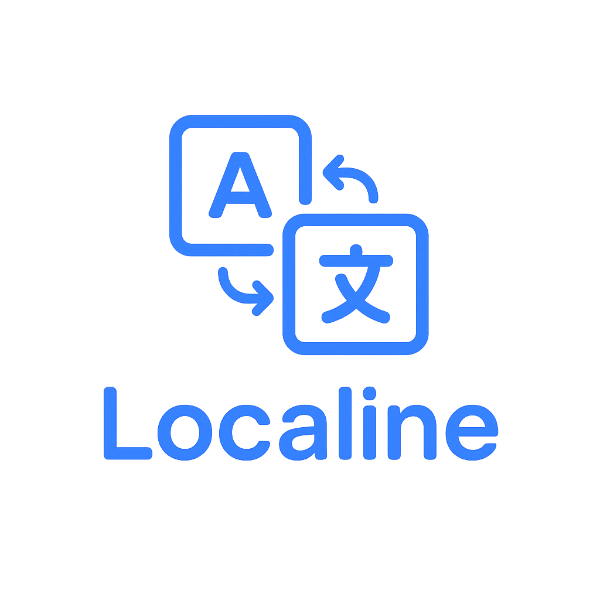

<div align="center">
  

  # Localine
  
  [](https://nextjs.org/)
  [](https://www.typescriptlang.org/)
  [](https://www.gnu.org/licenses/agpl-3.0)
  
  **An open translation management platform for teams**
  
  [Features](#features) • [Tech Stack](#tech-stack) • [Configuration](#configuration) • [License](#license)
</div>

---

## 📋 Table of Contents

- [Features](#features)
- [Tech Stack](#tech-stack)
- [Configuration](#configuration)
- [Environment Variables](#environment-variables)
- [Development](#development)
- [License](#license)
- [Support](#support)

---

## ✨ Features

- 🔐 **User Authentication** - Secure signup/login with JWT-based session management
- 📁 **Project Management** - Create and manage multiple translation projects
- 👥 **Team Collaboration** - Invite team members with role-based access control
- 🌍 **Multi-language Support** - Add multiple locales to your projects
- 📝 **Terms & Translations** - Manage translation keys and their translations
- 🔑 **API Keys** - Generate API keys with role-based permissions
- 🎨 **Modern UI** - Beautiful interface built with Radix UI and Tailwind CSS
- 📊 **RESTful API** - Complete API for integration with your applications
- 🔍 **Search & Filter** - Powerful search and filtering capabilities
- 📥 **Import/Export** - Support for multiple translation file formats

---

## 🛠️ Tech Stack

| Category | Technology |
|----------|-----------|
| **Framework** | Next.js 16 (App Router) |
| **Language** | TypeScript |
| **Database** | MariaDB / MySQL |
| **ORM** | Prisma |
| **UI Components** | Radix UI |
| **Styling** | Tailwind CSS |
| **State Management** | TanStack Query (React Query) |
| **Authentication** | JWT with httpOnly cookies |
| **API Documentation** | Swagger/OpenAPI |

---

## ⚙️ Configuration

### Environment Variables

See `.env.example` for required environment variables:

| Variable | Description | Default | Required |
|----------|-------------|---------|----------|
| `DATABASE_HOST` | Database host | `localhost` | ✅ |
| `DATABASE_PORT` | Database port | `3306` | ✅ |
| `DATABASE_USER` | Database user | - | ✅ |
| `DATABASE_PASSWORD` | Database password | - | ✅ |
| `DATABASE_NAME` | Database name | `localine` | ✅ |
| `JWT_SECRET` | Secret key for JWT tokens (min 32 characters) | - | ✅ (Production) |

### Database Setup

Ensure your database is running and accessible with the credentials specified in your `.env` file.

---

## 🚀 Development

### Project Structure

```
src/
├── app/              # Next.js app router pages
│   ├── (auth)/      # Authentication pages
│   ├── (dashboard)/ # Dashboard pages
│   └── api/         # API routes
├── components/       # React components
│   ├── ui/          # UI components (Radix)
│   └── layout/      # Layout components
├── hooks/           # Custom React hooks
└── lib/             # Utility libraries
    ├── auth.ts      # Authentication utilities
    ├── db.ts        # Database utilities
    └── prisma.ts    # Prisma client
```

### Available Scripts

```bash
npm run dev         # Start development server
npm run build       # Build for production
npm run start       # Start production server
npm run lint        # Run ESLint
```

### API Documentation

Once the server is running, you can access the API documentation at:

```
http://localhost:3000/api
```

---

## 📝 License

This project is licensed under the GNU Affero General Public License v3.0. See the [LICENSE](LICENSE) file for details.

---

## 🤝 Contributing

Contributions are welcome! Please feel free to submit a Pull Request.

1. Fork the repository
2. Create your feature branch (`git checkout -b feature/amazing-feature`)
3. Commit your changes (`git commit -m 'Add some amazing feature'`)
4. Push to the branch (`git push origin feature/amazing-feature`)
5. Open a Pull Request

---

## 📞 Support

If you encounter any problems or have questions, please open an [issue](https://github.com/LocalineServices/web-app/issues) on GitHub.

---

<div align="center">
  Made with ❤️ by ItzMxritz & LeonJS_
  
  [GitHub](https://github.com/LocalineServices)
</div>
